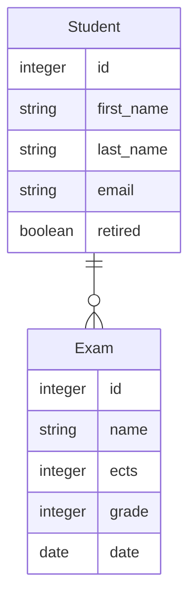

# SSO Protected Resource

## Repository

https://github.com/Guybrush3791/boolean-uk-1-fortnox-springboot-sso-protected-res.git

## Learning Objectives

- *SSO auth* through self-hosted *Keycloak*

## Instructions

1. Fork this repository
2. Clone your fork to your machine
3. Open the project in *IntelliJ*
4. Copy `application.yaml.example` to `application.yml` and fill out your *database* and *security* connection details
5. Check that `build.gradle` contains the correct dependencies and rerun gradle sync to make it all update

## Activity
### Core
Implement a new project in realm of `booleanuk-application` with following *Student* `Entity`

| Student    |         |             |
| ---------- | ------- | ----------- |
| id         | SERIAL  | PRIMARY KEY |
| first_name | TEXT    |             |
| last_name  | TEXT    |             |
| email      | TEXT    |             |
| retired    | BOOLEAN |             |

#### Routes
The [[doc/index-core.html|Core]] spec is in the usual `doc` folder, hire a resume

| Method     | Endpoint                   | Description                                     |
| :--------- | :------------------------- | :---------------------------------------------- |
| **GET**    | `/api/public/student`      | get all students                                |
| **GET**    | `/api/public/student/{id}` | get student by id                               |
| **POST**   | `/api/student`             | create student (dto without id as request body) |
| **PUT**    | `/api/student/{id}`        | update student (dto without id as request body) |
| **DELETE** | `/api/student/{id}`        | delete student by id                            |

#### Authentication
As in the morning lesson, get protection over all *non-public* resources, so only authenticated user can perform *write* actions

##### Public

| Method     | Endpoint                   | Description                                     |
| :--------- | :------------------------- | :---------------------------------------------- |
| **GET**    | `/api/public/student`      | get all students                                |
| **GET**    | `/api/public/student/{id}` | get student by id                               |

##### Protected

| Method     | Endpoint                   | Description                                     |
| :--------- | :------------------------- | :---------------------------------------------- |
| **POST**   | `/api/student`             | create student (dto without id as request body) |
| **PUT**    | `/api/student/{id}`        | update student (dto without id as request body) |
| **DELETE** | `/api/student/{id}`        | delete student by id                            |

#### Note
- make sure you are a new completely new *realm* in order to test the whole process, from Keycloak configuration to *SpringBoot* project develop

### Extension
Implement a related table `exams` following this diagram

Following `Exams` table design

| Exams |         |             |
| ----- | ------- | ----------- |
| id    | SERIAL  | PRIMARY KEY |
| name  | TEXT    |             |
| ects  | Integer |             |
| grade | Integer |             |
| date  | Date    |             |

#### Routes
The [[doc/index-extension.html|Extension]] spec is in the usual `doc` folder, hire a resume

| Method     | Endpoint                 | Description                                   |
| :--------- | :----------------------- | :-------------------------------------------- |
| **GET**    | `/api/public/exams`      | get all exams                                 |
| **GET**    | `/api/public/exams/{id}` | get exams by id                               |
| **POST**   | `/api/exams`             | create exams (dto without id as request body) |
| **PUT**    | `/api/exams/{id}`        | update exams (dto without id as request body) |
| **DELETE** | `/api/exams/{id}`        | delete exams by id                            |

#### Authentication
As in the morning lesson, get protection over all *non-public* resources, so only authenticated user can perform *write* actions

##### Public

| Method  | Endpoint                 | Description     |
| :------ | :----------------------- | :-------------- |
| **GET** | `/api/public/exams`      | get all exams   |
| **GET** | `/api/public/exams/{id}` | get exams by id |

##### Protected

| Method     | Endpoint          | Description                                   |
| :--------- | :---------------- | :-------------------------------------------- |
| **POST**   | `/api/exams`      | create exams (dto without id as request body) |
| **PUT**    | `/api/exams/{id}` | update exams (dto without id as request body) |
| **DELETE** | `/api/exams/{id}` | delete exams by id                            |

#### Note
- find a proper way to deal with the relation between entities, especially the *loop* when you read entities with relations, and *delete* element related to other element
